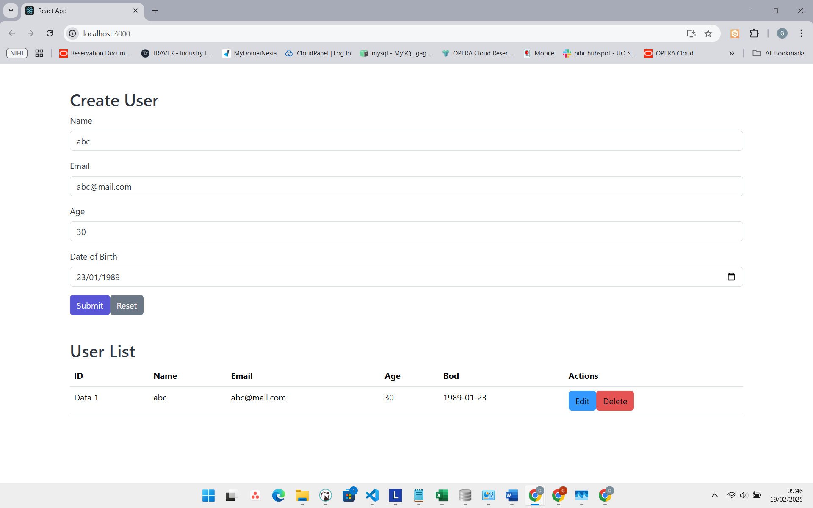

1. npm install on root
2. goto folder src/client/src
3. npm install on src/client/src
4. npm run build on src/client/src
5. check index.js on root , make sure all settings / config is correct
6. editing on route, controller and services
7. editing on userform and also userlist
8. for Running the services ( npm run start ) on root

